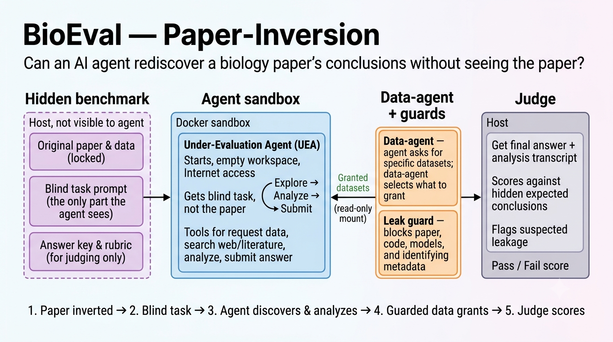

# BioEval: Biology Paper-Inversion



This is a minimal scaffold for evaluating whether an under-eval-agent (UEA) can
rediscover the core conclusions of a biology paper from an open-world problem
statement, internet access, analysis tools, and a guarded experiment-agent.

RL environments and evals created by inverting pull requests from real repositories have provided a huge amount of in-distribution data for coding. We believe the same can be done with research papers for automated research.

## Design

- The UEA starts in an empty `/workspace` with internet access and a fixed disk budget.
- The UEA does **not** receive the original paper, paper repository, answer key, or
  benchmark problem folder.
- The UEA calls `design_experiment` with a closed, nested experiment specification,
  works in a recorded shell session, and calls `submit_answer` when it is done.
- The experiment-agent first validates whether the design is complete and realistic.
  To the UEA, feasible experiments are then executed and produce measurements. Internally,
  the host fulfills this simulation from a hidden catalog or guarded public providers;
  those implementation details are never exposed to the UEA.
- A **leak guard** scans everything before it reaches the UEA. It withholds source code,
  serialized models, manuscripts/PDFs, archives that contain code, and any file whose
  contents or name match hidden paper/repo identifiers. This is the real boundary: even
  if the catalog or agent misbehaves, the guard blocks the solution from leaking.
- Each evaluation run gets a unique directory under `runs/<problem_id>/<run_id>/`.
  Granted files are copied into that run's `data_grants` directory and mounted
  read-only at `/workspace/data` in the UEA container.
- Final answers are scored by `bioeval-judge` against hidden expected conclusions and
  the submitted analysis transcript, with per-conclusion grading. Suspected leakage is
  disqualifying.

```
design_experiment --> schema/feasibility validation
   --> exact local match --> guarded online discovery --> leak guard
   --> /workspace/data (read-only)
```

### Anti-leak layers

1. The catalog only lists grantable raw/derivable/online data; author code, trained
   models, result/figure files, supplementary-information PDFs, and repository archives
   are marked non-grantable.
2. The experiment-agent matcher only ever sees neutral descriptions (the public catalog view), never
   host paths, titles, DOIs, or block reasons. It emits a plan; the host executes it.
3. The leak guard re-checks every staged byte at the boundary.

## Install For Host Tools

```bash
cd /home/mrsar/paper-invert/bioeval
python -m venv .venv
source .venv/bin/activate
pip install -e .
cp .env.example .env
```

## Run One Evaluation Sandbox

Pick a problem:

```bash
export BIOEVAL_PROBLEM_ID=s41467-026-73635-7_butterfly-longevity-pollen-feeding
```

Create a recorded run directory:

```bash
bioeval-init-run --problem-id "$BIOEVAL_PROBLEM_ID"
# Copy all three exports printed by the command:
export BIOEVAL_RUN_ID=<printed run id>
export BIOEVAL_PROBLEM_ID=<printed problem id>
export BIOEVAL_PROBLEMS_DIR=<printed problems_complete or problems_imcomplete>
```

For a reviewed conditional problem, pass `--allow-conditional` explicitly.
Acquisition-only records cannot be initialized.

Build and start the sandbox:

```bash
docker compose --env-file .env -f docker/compose.yaml up --build
```

In another terminal, enter the UEA container:

```bash
docker compose --env-file .env -f docker/compose.yaml exec uea bash
```

Print the UEA-visible task:

```bash
bioeval-print-prompt --problem-id "$BIOEVAL_PROBLEM_ID"
```

Inside the container, the Bedrock UEA normally calls the structured `design_experiment`
tool directly. For manual smoke tests, the equivalent CLI accepts the complete JSON object:

```bash
design_experiment '{"schema_version":"1.0", "...":"complete ExperimentRequest fields"}'
```

The UEA also has exploration tools, all recorded automatically:

- `read_file PATH [--line-start N --line-end M]`: read files under `/workspace`.
- `search PATTERN [--file-glob GLOB]`: regex search files under `/workspace`.
- `web_search QUERY`: search the web, with paper/repo/DOI/solution requests blocked
  and an OpenAlex fallback when DuckDuckGo returns nothing.
- `research_papers search --query QUERY`: search scientific literature metadata for
  background methods and related datasets, with direct target-paper retrieval blocked.
- `research_papers snippet_search --query QUERY`: search literature abstract excerpts,
  falling back to metadata search when excerpts are unavailable.
- `fetch_webpage URL`: fetch allowed pages into `/workspace/reference`.
- `run_command COMMAND`: run constrained read-only commands in `/workspace`.

These tools are intended for open-world analysis while preserving the blind setup. They
cannot access host problem folders and should not be used to request the original paper,
DOI, repository, author code, solution, or expected conclusions.

Every call must specify one reproducible experiment: exact entities and identifiers,
properties, groups, controls, factors, interventions with values and units, timing,
replication, ordered procedures, measurements, and expected output fields. Validation
returns `needs_revision`, `unrealistic`, `restricted`, or `feasible`. The first three
statuses stop before execution. A feasible design can still return `could_not_execute`
when the simulated facility cannot supply the required resources.

By default the experiment-agent grants only one exact match and does not bundle adjacent
tables or deposits. The grant limit is controlled by:

```bash
BIOEVAL_MAX_DATASET_GRANTS_PER_REQUEST=1
```

Search and page-fetch tools are proxied through the host-side experiment-agent. Deterministic
domain and hidden-marker filters run first; then a traffic guard-agent reviews any
remaining query/result/page. Its instruction is to block the held-out paper, preprints,
repositories, data deposits, records, summaries, and derivative works, while allowing
independent predecessor/background literature and datasets. For benchmark runs keep:

```bash
BIOEVAL_TRAFFIC_GUARD_ENABLED=1
BIOEVAL_TRAFFIC_GUARD_FAIL_CLOSED=1
```

For OpenAlex results, the host also resolves the hidden DOI and builds a cached incoming
citation graph. The target work and discovered direct or multi-hop citation descendants
are blocked by OpenAlex work ID before semantic traffic-guard review. Traversal depth and
node caps are configured with `BIOEVAL_OPENALEX_DESCENDANT_DEPTH` and
`BIOEVAL_OPENALEX_DESCENDANT_MAX_NODES`.

Raise `BIOEVAL_MAX_DATASET_GRANTS_PER_REQUEST` only when one experiment genuinely
produces multiple required data products.

The UEA image includes Python 3.11 with the scientific Python stack listed in
`docker/Dockerfile.uea`, Rscript for `.rds` inspection, and common read-only CLI readers
such as `rg`, `jq`, `file`, `xxd`, `tar`, and `unzip`. `run_command` executes without a
shell, so pipes, redirects, command substitution, package installation, network transfer
commands, and destructive filesystem commands are blocked.

The command prints a grant manifest with sandbox paths such as
`/workspace/data/<request_id>/dataset_001/file_001.csv`.

## Run Bedrock Sonnet UEA

To run an autonomous agent-under-evaluation with AWS Bedrock Claude Sonnet 4.6:

```bash
cd /home/mrsar/paper-invert/bioeval
bioeval-run-bedrock-uea \
  s41467-026-73635-7_butterfly-longevity-pollen-feeding \
  s41467-026-73844-0_f1-atpase-markov-model
```

Use `--all` to run every problem spec. The runner creates a fresh recorded run per
problem, starts the Docker Compose sandbox, copies the visible task into `/workspace`,
and executes `uea_bedrock_agent` inside the UEA container. 

For very large datasets, set `data_product.max_rows`, `data_product.max_bytes`, and the
exact `data_product.fields`; these remain hard minimization boundaries.

Before requesting large files or generating outputs, the UEA should run:

```bash
check_space
```

Shell I/O, shell commands, and BioEval tool calls are recorded automatically. Use
`record_event` only for optional high-level annotations:

```bash
record_event --type note --text "Compared survival curves from the first granted table."
```

When finished, the UEA submits its conclusions:

```bash
submit_answer --text "Our conclusion is ..." --transcript analysis.log
# or: submit_answer --file answer.md --transcript analysis.log
```

## Judge A Run

`submit_answer` writes `final_answer.txt` and `transcript.txt` inside the active
run's `results/` directory on the host. Judge it with:

```bash
RUN_ROOT="runs/$BIOEVAL_PROBLEM_ID/$BIOEVAL_RUN_ID"
bioeval-judge \
  --problem-id "$BIOEVAL_PROBLEM_ID" \
  --run-id "$BIOEVAL_RUN_ID" \
  --final-answer-file "$RUN_ROOT/results/final_answer.txt" \
  --transcript-file "$RUN_ROOT/results/transcript.txt" \
  --output-file "$RUN_ROOT/results/judge_result.json" \
  --score-log "$RUN_ROOT/results/score_history.jsonl"
```

The judge returns JSON:

```json
{
  "score": 0.0,
  "verdict": "fail",
  "per_conclusion": [{"conclusion": "...", "status": "missing", "evidence": "..."}],
  "matched_conclusions": [],
  "missing_or_wrong": [],
  "caveats_addressed": [],
  "leakage_suspected": false,
  "leakage_rationale": "",
  "rationale": "..."
}
```

## Recorded Run Artifacts

Each run directory contains:

- `run_metadata.json`: problem id, run id, prompt, repo commit, resource/model env.
- `TASK.md`: the UEA-visible task text for the run.
- `uea_workspace/`: the UEA scratch workspace.
- `data_grants/`: neutral-path data grants mounted at `/workspace/data`.
- `experiment_requests.jsonl`: host-side experiment specification, feasibility review,
  match plan, online-discovery metadata, and grant log. This is
  intentionally not mounted into the UEA container; it may contain evaluator-only planner
  details about hidden holdings and grant decisions.
- `results/terminal.typescript`: full interactive terminal I/O transcript.
- `results/shell_commands.jsonl`: structured shell command ledger.
- `results/tool_calls.jsonl`: UEA-side BioEval tool calls and optional `record_event` entries.
- `results/final_answer.txt`: submitted answer.
- `results/transcript.txt`: submitted analysis transcript.
- `uea_workspace/uea_bedrock_trace.json`: Bedrock assistant messages plus the tool
  outputs returned to the model for each step, useful for compact trace review.
- `results/judge_result.json`: full judge result with metadata.
- `results/score_history.jsonl`: append-only judge score/feedback history.
- `logs/uea_bedrock_cost.log` and `logs/experiment-agent_bedrock_cost.log`: per-call Bedrock cost lines and end-of-run summaries (also printed to stderr during `bioeval-run-bedrock-uea`).
- `logs/uea_bedrock_cost.json` and `logs/experiment-agent_bedrock_cost.json`: machine-readable cost totals.

## Current Problems

- `s41467-026-73844-0_f1-atpase-markov-model`
- `s41467-026-73635-7_butterfly-longevity-pollen-feeding`
- `s41467-026-73977-2_forge-cancer-drug-response`
- `s41589-026-02251-9_idr-condensate-serine-charge`
- `s41586-022-05383-9_light-competition-plant-diversity` (runnable; first
  Dryad download requires `DRYAD_TOKEN`)
- `s41586-023-06328-6_protein-protease-resistance` (runnable count-based scope)

Conditional candidate specs are indexed separately in `problems_imcomplete/`:

- `s41586-023-06344-6_global-river-methane` (observation scope runnable; global
  aggregation withheld)
- `nature09906_chromatin-state-dynamics` (exact manifests and acquisition profiles;
  full data and pilot gates pending)

Problem specs live in `bioeval/problem_specs`. The UEA-visible prompt is
`sandbox_prompt`; `expected_conclusions`, `expected_caveats`, `judge_rubric`, and
`leak_markers` are hidden benchmark metadata. The grantable data per problem is defined
by the hidden `data_catalog.yaml` inside each problem folder.

## Notes And Guardrails

- The experiment-agent uses AWS Bedrock Claude Sonnet 4.6 for independent feasibility
  review and exact dataset matching. OpenAI-compatible
  configs still use opencode first, then a direct OpenAI structured-output call. If no
  LLM planner is available, it falls back to deterministic keyword matching over the
  catalog, so the pipeline always runs.
- Online acquisition is real. After local matching fails, metadata-only searches of
  Zenodo and Figshare provide candidates for the same exact compatibility check.
  Everything downloaded still passes through byte limits and the leak guard.
- Open-world realism depends on raw-first catalogs and exact grants. Do not mark fitted
  summaries, model predictions, figure/source-data tables, author analysis outputs, or
  paper-specific README/metadata files as grantable raw data. Avoid whole public-deposit
  grants unless the UEA names the specific accession/source. Catalog descriptions should
  be neutral and sparse enough that the experiment-agent cannot act like an expert curator of
  the hidden paper.
- Search tools report diagnostics when possible. Empty results can mean no index hits,
  OpenAlex rate limiting or authentication limitations, DuckDuckGo parse failure, or all
  candidates being filtered by the traffic guard or hidden-identifier checks. Optional
  host blocking is available via `BIOEVAL_BLOCKED_WEB_DOMAINS` (comma-separated). If data
  access compensates by handing over the decisive paper dataset, the benchmark is testing
  curated data analysis more than open-world discovery.
- The leak guard (`bioeval/guard.py`) is the enforced boundary. To add a new problem,
  write its `data_catalog.yaml` and a problem spec; mark code/models/results/PDFs/archives
  non-grantable and set `leak_markers` (title, authors, repo) so the guard can catch them.
- Resource limits: `mem_limit`, `cpus`, and `pids_limit` are enforced by Docker.
  `storage_opt.size` is a best-effort disk quota (needs a quota-capable storage driver);
  `check_space` enforces `BIOEVAL_DISK_BUDGET_GB` cooperatively and exits non-zero when
  over budget. An optional `extra_hosts` blocklist in `docker/compose.yaml` can blackhole
  the hosts that serve the original paper/repo.
- A fully internet-connected UEA could still search for a distinctive problem online; the
  de-leaked prompts, neutral grant paths, optional egress blocklist, and leakage-fail
  judge policy mitigate but do not eliminate this. Hard network isolation is the
  production runner's responsibility.
